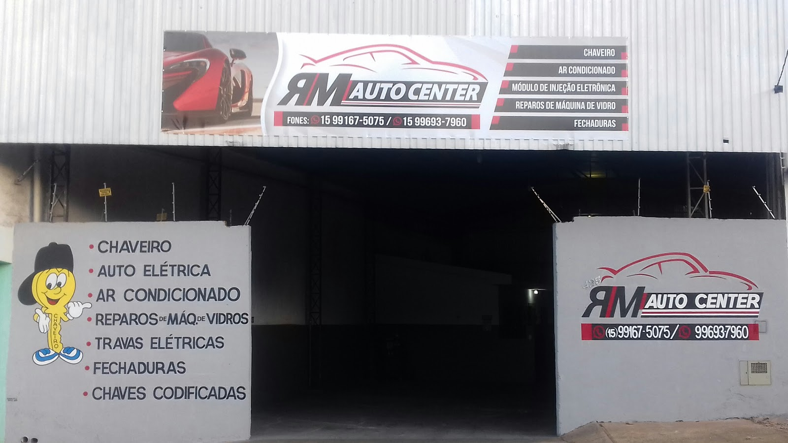

# 🏎️ RM Auto Center - Landing Page Premium

Landing page de alta conversão para a **RM Auto Center** (Itapeva-SP), com foco em serviços de Auto Elétrica, Injeção Eletrônica e Ar-Condicionado. Inclui um Assistente de Agendamento Inteligente integrado ao Supabase e WhatsApp.



## 🌟 Funcionalidades

- **Design Premium**: Estética moderna com Glassmorphism e Framer Motion.
- **Assistente IA**: Bot conversacional que valida placas, datas e sugere horários em tempo real.
- **Agendamento Real**: Integração nativa com Supabase para persistência de dados.
- **Otimizado para Mobile**: Layout totalmente responsivo e botões de ação rápida.
- **Mapa Integrado**: Localização exata no Google Maps para a unidade de Itapeva.

## 🛠️ Tecnologias

- **Frontend**: React 19 + TypeScript + Vite.
- **Estilização**: Tailwind CSS.
- **Animações**: Framer Motion + Lucide React.
- **Backend/DB**: Supabase.
- **Deploy**: Vercel.

## 🚀 Como Rodar o Projeto

1. **Clone o repositório**:
   ```bash
   git clone <seu-repositorio-url>
   cd rm-auto-center
   ```

2. **Instale as dependências**:
   ```bash
   npm install
   ```

3. **Configure as Variáveis de Ambiente**:
   - Renomeie `.env.example` para `.env.local`.
   - Adicione suas chaves `VITE_SUPABASE_URL` e `VITE_SUPABASE_ANON_KEY`.

4. **Inicie o servidor de desenvolvimento**:
   ```bash
   npm run dev
   ```

## 📦 Configuração do Banco de Dados (Supabase)

Copie o conteúdo do arquivo `database.sql` e execute no **SQL Editor** do seu dashboard no Supabase. Isso criará a tabela `appointments` necessária para o funcionamento do bot.

## 🌍 Deploy na Vercel

1. Conecte seu repositório GitHub à Vercel.
2. Nas configurações do projeto, adicione as variáveis de ambiente:
   - `VITE_SUPABASE_URL`
   - `VITE_SUPABASE_ANON_KEY`
3. O deploy será feito automaticamente a cada push na `main`.

---
Desenvolvido por **Antigravity AI** para RM Auto Center.
